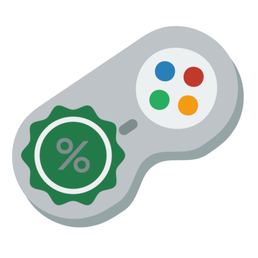
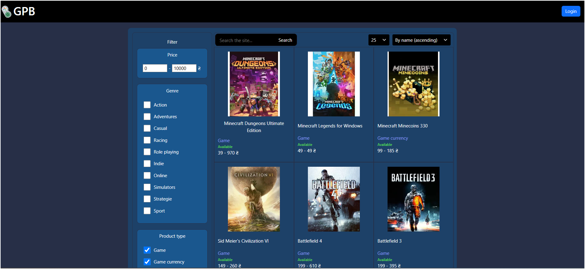
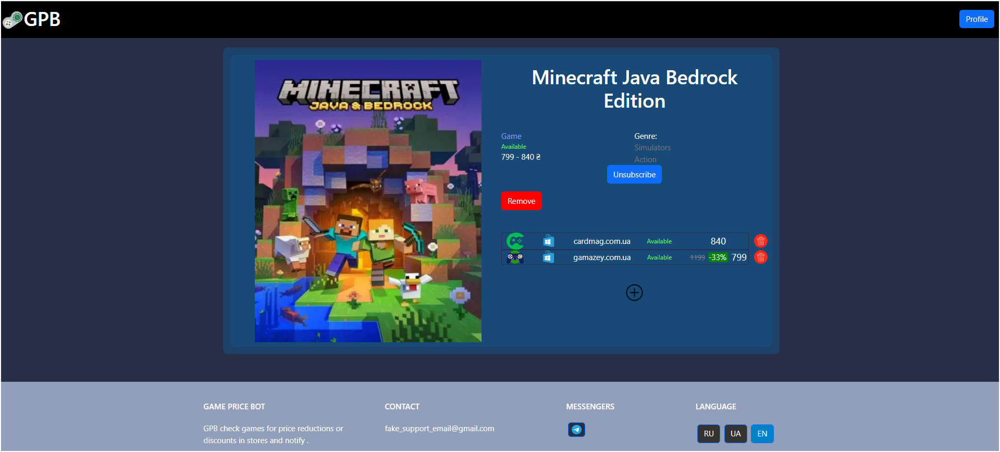
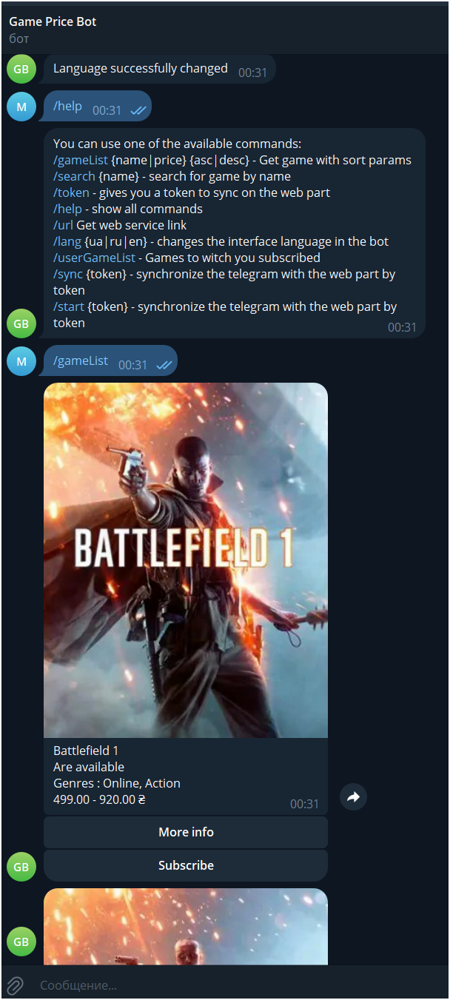

<p align="center">
  
</p>

# Game Price Bot

Game Price Bot is a web application that aggregates information from multiple online stores to help users find the best video game prices.  
Users can also subscribe to price changes via email or messenger.

💡 This project is fully runnable locally using Docker or Minikube.  
No paid cloud infrastructure is required.

📌 This project is part of my learning portfolio.  
I built it to deepen my knowledge in full-stack development, distributed systems, and infrastructure automation.

---

## Screenshots

### 🖥️ Main UI

<p align="left"><i>Main UI: browse and filter games</i></p>

### 🎮 Game Details

<p align="left"><i>Game Details: View prices from multiple stores and manage subscriptions</i></p>

### 🤖 Telegram Bot

<p align="left"><i>Telegram Bot: Search, track, and subscribe to games via chat commands</i></p>

## ✨ Features
- 🔍 Search for games with filters (genre, price, etc.)
- 📉 Track price changes and discounts
- 📬 Notifications via Telegram or Email
- 📊 Grafana dashboard for metrics
- 🐳 Docker & Kubernetes support


Currently supports the following stores:
- 🛒 [Gamazey](https://gamazey.com.ua)
- 🛒 [Cardmag](https://cardmag.com.ua)

Currently supported messenger:
-  Telegram

🚨 Disclaimer 🚨

This project is created for educational and technology exploration purposes only. It is not intended for commercial use.

* All data is collected from publicly available sources.
* Links to the original stores are provided in the application.
* No copyrighted content is stored or distributed by this application.

If you are the owner of any listed store and have concerns about data usage, please contact us,
and we will take appropriate action.

## 🧪 App could be run in Docker, Kubernetes  or launch it directly in your development environment.

<details>
  <summary>💻 Development environment </summary>

## Setup for development environment:

* PostgreSQL latest version
* Zookeeper 3.9.1 or higher
* Kafka 3.6.1 or higher
* Node 18.18.0
* JDK 17 or higher
* Apache Maven 3.9.0 or higher
* Gradle 8.0.2 or higher

## Step for running in development environment:

* Launch PostgreSQL server
* Start zookeeper
* Start kafka
* Start all needed services

</details>

<details>
  <summary>🐳 Docker setup </summary>

## To work with GPB in Docker you need:

* Install Docker
  Docker is needed to build images and run containers.

Download and install Docker Desktop: https://www.docker.com/products/docker-desktop/
Enable WSL 2 integration in Docker settings.

## To run GPB in Docker after installing, create a ".env" file and use the following command in root of project:

```console
docker-compose up -d
```

or if you want to build images:
```console
docker-compose up -d --build
```


</details>

<details>
  <summary>☸️ Kubernetes  setup</summary>


## To work with GPB in Kubernetes you need:

1. Install Windows Subsystem for Linux (WSL)
   Since the script is written in Bash, you need a Linux environment. Install WSL2 and a distribution like Ubuntu.

Run PowerShell as Administrator and execute:

```console
wsl --install
```

Restart your PC and install Ubuntu from the Microsoft Store.

2. Install Docker
   Docker is needed to build images and run containers.

Download and install Docker Desktop: https://www.docker.com/products/docker-desktop/
Enable WSL 2 integration in Docker settings.

3. Install Minikube
   Minikube allows you to run Kubernetes locally.

Install it via Chocolatey (in PowerShell as Administrator):

```console
choco install minikube
```

Or download it from: https://minikube.sigs.k8s.io/docs/start/

4. Install kubectl
   Kubernetes CLI is required for managing the cluster.

Install via Chocolatey:

```console
choco install kubernetes-cli
```

Or download from: https://kubernetes.io/docs/tasks/tools/install-kubectl/

5. Install helm
   Helm is the package manager for Kubernetes, used to manage and install applications.

Install via Chocolatey:

```console
choco install kubernetes-helm
```

Or download from: https://helm.sh/docs/intro/install/

## To run GPB in Minikube after installing in terminal run:

### For stable operation of all services allocate at least 5.5–8 GB of RAM to Minikube.:

```console
minikube start --driver=docker --cpus=4 --memory=8000
```

### Add to /etc/hosts (Linux/macOS) or C:\Windows\System32\drivers\etc\hosts (Windows):

##### On Windows:

```console
127.0.0.1 game.price.bot grafana.gpb
```

##### On Linux/macOS:

1. Use the EXTERNAL-IP of the ingress-nginx-controller service:

```console
kubectl get svc -n ingress-nginx
```

2. Then add the IP to /etc/hosts:

```console
EXTERNAL_IP game.price.bot grafana.gpb
```

### Create a ".env" file and use the following command in root of project:


```console
bash full-deploy.sh
```

### Open minikube tunnel by the following command:

```console
minikube tunnel
```

After running the script and opening the tunnel, keep the terminal open to maintain the tunnel connection.
You can access the services via the following links:

Frontend: https://game.price.bot
Backend: https://game.price.bot/api
Grafana: https://grafana.gpb 

Login for grafana: admin , password from ".env"

* WARNING: If ingress-nginx or other pods stay in ContainerCreating or Pending state for too long, it's likely due to insufficient resources in Docker + WSL2. In that case make sure to increase memory and CPU limits via '.wslconfig'. 

</details>


<details>
  <summary>⚙️ Environment Variables (.env)</summary>

### Environments in ".env" file (with defaults values for docker and minikube) :

PostgreSQL Configuration:

* POSTGRES_DB: The name of the database to be created in PostgreSQL.
    * Default: postgres
    * Set your custom database name here.

* POSTGRES_USER: The username to connect to the PostgreSQL database.
    * Default: postgres
    * Set your desired username here.

* POSTGRES_PASSWORD: The password for the PostgreSQL user.
    * Set a strong password for your PostgreSQL user here.

* POSTGRES_URL: The JDBC URL to connect to the PostgreSQL database.
    * Default: jdbc:postgresql://postgres:5432/postgres
    * You typically do not need to change this unless you are running PostgreSQL on a different host or port.

Kafka Configuration:

* KAFKA_SERVER_URL: The URL of the Kafka server for your backend to communicate with.
    * Default: kafka:9093 for docker compose , kafka:9092 for minikube
    * Set the correct Kafka server URL if it is different from the default.

Other Configuration:

* GAMES_IMAGE_FOLDER: The folder path for storing game-related images.
    * Default: /image_folder
    * Set your desired folder path here.

* FRONT_SERVICE_URL: The URL for the frontend service.
    * Default: http://localhost:3000 for docker compose , http://game.price.bot for minikube
    * Adjust this if your frontend service is running on a different host or port.

* BACKEND_SERVICE_URL: The URL for the backend service.
    * Default: http://localhost:8080/api for docker compose , http://game.price.bot/api for minikube
    * Adjust this if your backend service is running on a different host or port.

* GAME_SERVICE_URL: The URL for the game service.
    * Default: http://game:8081 for docker compose , http://game-service:8081 for minikube
    * Modify this URL if your game service runs on a different address or port.

* SUPPORT_EMAIL: The email address for support contact.
    * Set a valid email address for support contact here.

* TELEGRAM_BOT_URL: The URL for the Telegram bot.
  * Default: https://t.me/GamaPriceTelegramBot
  * Modify this URL if your Telegram bot runs on a different address or port.

* API_KEY: The API key used for service authorization between each other.
    * Default:
    * Set your unique API key here.

Admin Configuration:

* ADMIN_EMAIL: The email address for the admin user.
    * Set a valid email address for the admin user here.

* ADMIN_PASSWORD: The password for the admin user.
    * Set a password for the admin user here.

Mail Service Configuration:

* MAIL_USERNAME: The username for sending emails (e.g., Gmail address).
    * Enter the email address you will use to send notifications to users.

* MAIL_PASSWORD: The app password for the email account used for sending emails.
    * Set the correct password for the email account here.

Telegram Bot Configuration:

* TELEGRAM_BOT_TOKEN: The token for your Telegram bot, generated by BotFather.
    * Obtain a Telegram Bot token from BotFather and set it here or get from owner.

Token key Configuration:

* TOKEN_SECRET_KEY: Secret key for authentication token generation.

* REFRESH_TOKEN_SECRET_KEY: Secret key for refresh token generation.

Dependency Configuration:

* DEPENDENCY_REPO_URL: The folder path for storing game-related images.
    * Default: https://maven.pkg.github.com/IllusiveMan2186/GPB-common
    * Set url to dependency repository with common dependency

* DEPENDENCY_REPO_USERNAME: The URL for the frontend service.
    * Default: Your github username
    * Set username to account for reading dependency repository

* DEPENDENCY_REPO_PASSWORD: The URL for the game service.
    * Default: Your github personal access tokens
    * Set password to account for reading dependency repository

* GRAFANA_ADMIN_PASSWORD: The password for the Grafana admin user.
    * Set your password for Grafana admin user

You also could stop some docker parts and run part on yours development environment

</details>

-------------------------------------

## License

This project is licensed under the **MIT License (Modified for Non-Commercial Use)**.  
You are free to use, modify, and distribute the software **for non-commercial purposes only**.  
**Commercial use is strictly prohibited.**
